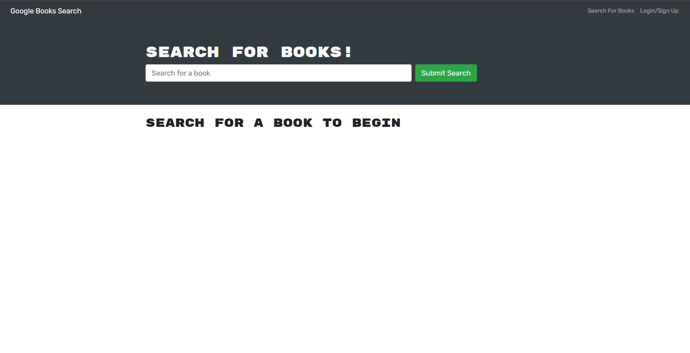

# MERN Google Book Search

## Description

This is a full stack MERN apapp that was converted from using a REST API to using GraphQL. A user can login, search for books and save books to look at later.

- My motivation for this app was to learn about the differences between REST and graphql.
- This app allows someone to keep book reccomendations in one place to view later.
- I learned about some of the benefits and drawbacks of using graphql. the benefits and the drawbacks of using graphql.

## Table of Contents

- [Installation](#installation)
- [Usage](#usage)
- [Credits](#credits)
- [License](#license)
- [Questions](#questions)

## Installation

N/A

## Usage

Click on the Login/Sign Up button to create an account to store books. After that, search for the book you're interested in. A list of books will apear. Click on the save button at the bottom of a book to save it for later. You can now view your stored books at any time and remove them if you need.

## Credits

N/A

## License

N/A

## Tests

N/A

## Questions

If you have any questions about this project, [visit my GitHub Profile](https://github.com/TuinderJ/) or [Email Me](mailto:joshua.tuinder@gmail.com)
